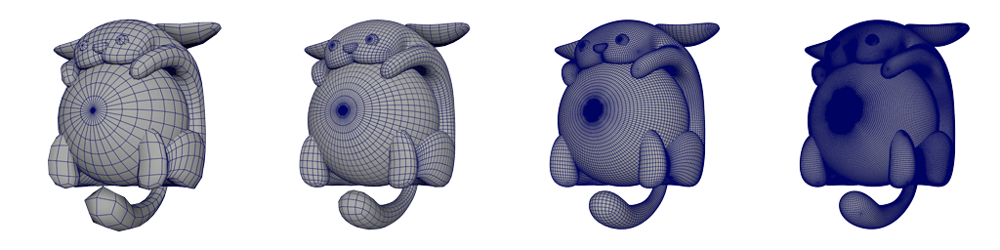
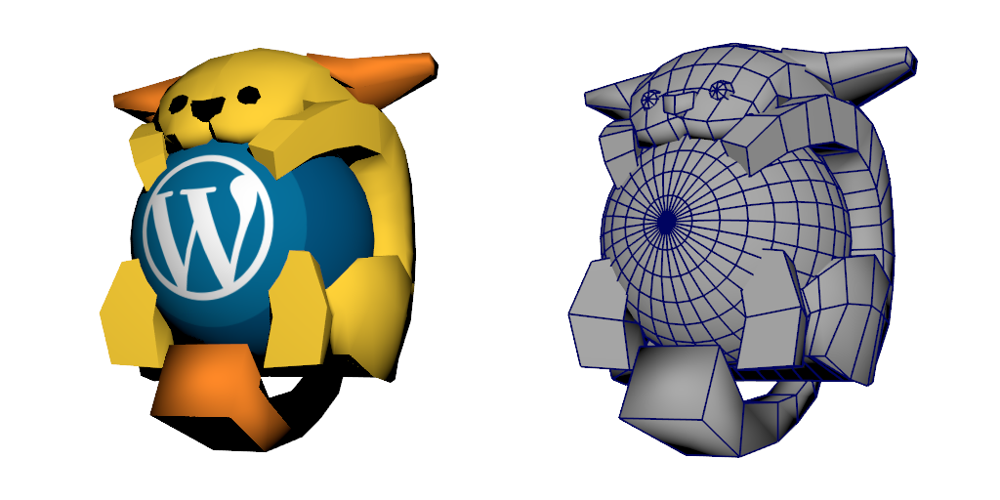

# 3D Wapuu

## [Model Preview](./models/for_the_3dcg/mid_quality/stl/wapuu_mid.stl)  
## For the 3DCG

### Low, middle, high, highest quality

### Before subdivision process

## For the 3D Printer

## Author, License, Version
Author : Takeshi Kashihara  
License: GPLv2 or later  
License URI: http://www.gnu.org/licenses/gpl-2.0.html  
Version : 2.0

## Description
This is 3D Wapuu polygon model data.  
You can use this data for 3DCG Software, and CAD software.  
And you can build 3D Wapuu thing by the 3D Printer.  

Wapuu is a official character of ja.wordpress.org, in Japan.  
He is loved by worldwide WordPress users.  

https://ja.wordpress.org/about-wp-ja/wapuu/  

## Data format
3D model data is in models directory, separated by low, mid, high, highest quality.  
### For the 3DCG image, the animation.(for_the_3dcg)
.dae (COLLADA COLLAborative Design Activity file format)  
.obj (cross-platform 3d-object format for the 3DCG image, the animation)  
.fbx (Filmbox file format)  
.shd (Shade3D Scene)  
.stl (stereolithography CAD data)  

### For the 3D Printer image, the animation.(for_the_3d_printer)
.stl (stereolithography CAD data)  

## Changelog  
### 1.1 - March 2 2016
* Add STL format for 3DCG.  

### 1.2 - March 2 2016
* Edited read.md, readme.txt.  

### 2.0 - May 5 2016
* modified the shape.  
* Add low, middle, high, highest quality data for 3DCG.  
* Add FBX, Shade3D, Collada format for 3DCG.  

### 2.1 - June 7 2016
* Add a three.js demo page.  
http://wckansai2016.github.io/3d-wapuu/demos/three.js/

### 2.2 - June 20 2016
* Add several models for the 3D Printer. 

### 3.0 - July 4 2016
* Add Maya Binary files.
* Add models that before subdivision process.  

